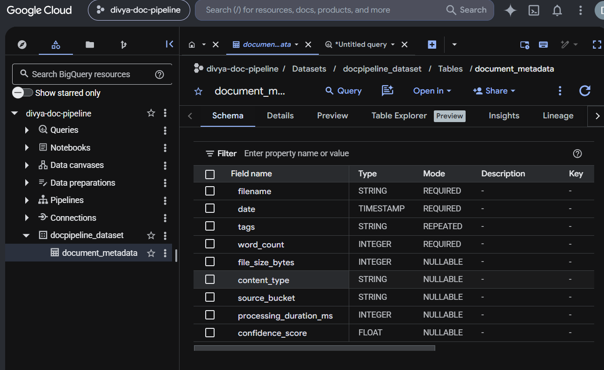
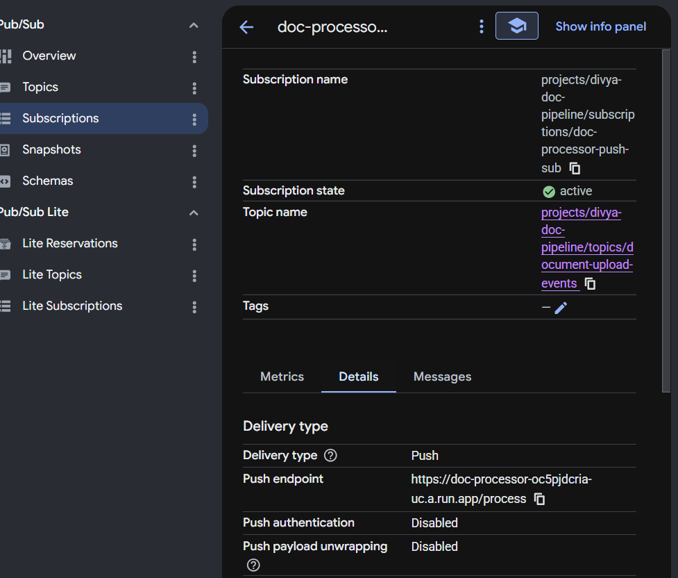
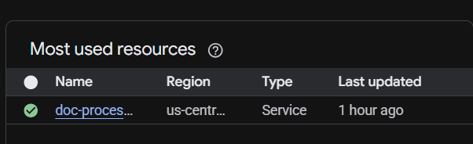
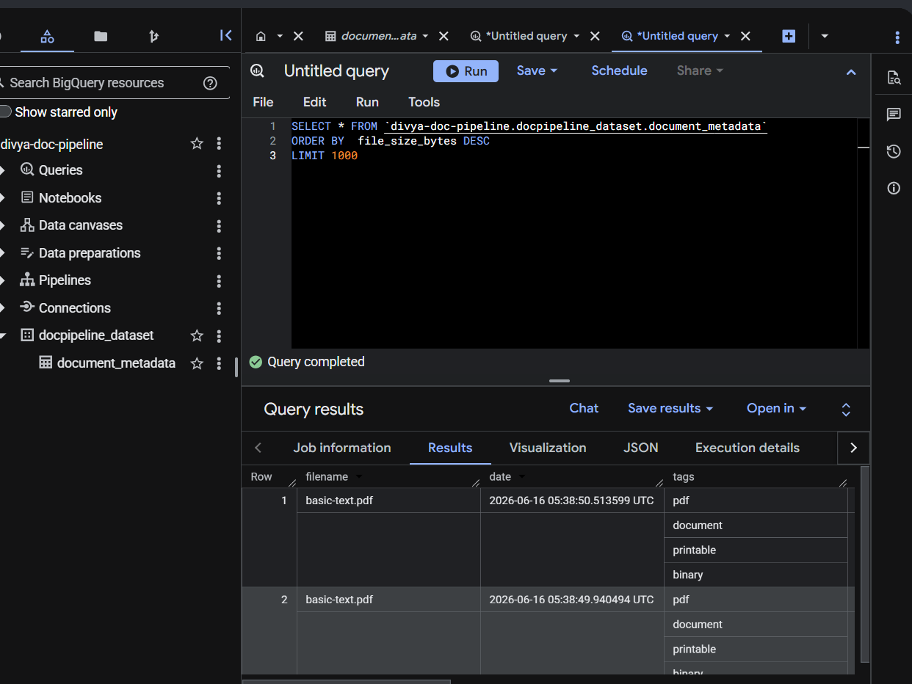
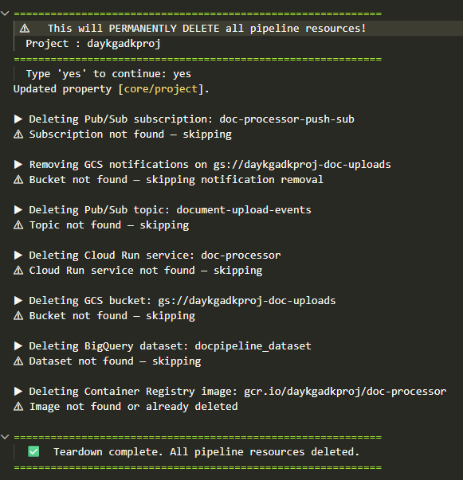

# ⚡ Serverless Doc Pipeline — Powered by Google Cloud + Antigravity  
#### Upload → Trigger → Process → Store → Done.

##An event-driven, serverless pipeline that processes file uploads automatically:
**Cloud Storage → Pub/Sub → Cloud Run (simulated OCR) → BigQuery**

---

## Architecture

```
User
 │  gsutil cp / Console upload
 ▼
Cloud Storage  (daykgadkproj-doc-uploads)
 │  OBJECT_FINALIZE notification
 ▼
Pub/Sub Topic  (document-upload-events)
 │  Push subscription  HTTP POST
 ▼
Cloud Run      (doc-processor)
 │  simulate_ocr() → metadata dict
 ▼
BigQuery       (docpipeline_dataset.document_metadata)
```

---

## Project Structure

```
google-cloud-serverless-app/
├── README.md          ← this file
├── deploy.sh          ← one-shot deployment (all GCP resources)
├── teardown.sh        ← full resource cleanup
└── processor/
    ├── main.py            ← FastAPI service (Pub/Sub push handler)
    ├── ocr_simulator.py   ← deterministic OCR simulation module
    ├── requirements.txt
    └── Dockerfile
```

---

## Quick Start

### 1. Prerequisites

```bash
# Authenticate with GCP
gcloud auth login
gcloud auth application-default login

# Confirm your project
gcloud config set project daykgadkproj
```

Ensure **Docker** is running (used by Cloud Build locally if needed).

### 2. Deploy Everything

```bash
chmod +x deploy.sh teardown.sh
./deploy.sh
```

The script will:
1. Enable required APIs
2. Create the GCS upload bucket
3. Create the Pub/Sub topic and GCS → topic notification
4. Create the BigQuery dataset + table
5. Build and push the Docker image via Cloud Build
6. Deploy the Cloud Run service
7. Create the push subscription pointing Cloud Run

At the end it prints ready-to-run smoke-test commands.

### 3. Test the Pipeline

```bash
# Upload a file
echo "Hello world document" > /tmp/test_doc.txt
gsutil cp /tmp/test_doc.txt gs://daykgadkproj-doc-uploads/

# Check Cloud Run logs (~10 seconds after upload)
gcloud run services logs read doc-processor \
  --region=us-central1 --limit=20

# Query BigQuery
bq query --use_legacy_sql=false \
  'SELECT filename, date, tags, word_count, confidence_score
   FROM `daykgadkproj.docpipeline_dataset.document_metadata`
   ORDER BY date DESC
   LIMIT 10'
```

-----

## BigQuery Schema

| Field | Type | Mode | Description |
|---|---|---|---|
| `filename` | STRING | REQUIRED | Original uploaded filename |
| `date` | TIMESTAMP | REQUIRED | UTC processing timestamp |
| `tags` | STRING | REPEATED | Auto-tags from extension + MIME type |
| `word_count` | INTEGER | REQUIRED | Simulated word count |
| `file_size_bytes` | INTEGER | NULLABLE | File size from GCS metadata |
| `content_type` | STRING | NULLABLE | MIME type from GCS object |
| `source_bucket` | STRING | NULLABLE | Originating GCS bucket |
| `processing_duration_ms` | INTEGER | NULLABLE | Processing time in ms |
| `confidence_score` | FLOAT | NULLABLE | Simulated OCR confidence (0.70–0.99) |



----

## Environment Variables (Cloud Run)

| Variable | Default | Description |
|---|---|---|
| `GCP_PROJECT_ID` | `daykgadkproj` | GCP project |
| `BQ_DATASET` | `docpipeline_dataset` | BigQuery dataset |
| `BQ_TABLE` | `document_metadata` | BigQuery table |
| `PORT` | `8080` | Injected by Cloud Run |

----

## API Endpoints

| Method | Path | Description |
|---|---|---|
| `GET` | `/health` | Liveness probe |
| `POST` | `/process` | Pub/Sub push handler |
| `GET` | `/docs` | Auto-generated Swagger UI |



----

## Cloud Run - Deployment service
Health: Green checkmark indicating the service is active.



----


## Example BigQuery Queries

```sql
-- Latest 10 processed documents
SELECT filename, date, tags, word_count, confidence_score
FROM `daykgadkproj.docpipeline_dataset.document_metadata`
ORDER BY date DESC
LIMIT 10;

-- Average word count by file type
SELECT
  ARRAY_TO_STRING(tags, ', ') AS tag_list,
  COUNT(*) AS file_count,
  AVG(word_count) AS avg_word_count,
  AVG(confidence_score) AS avg_confidence
FROM `daykgadkproj.docpipeline_dataset.document_metadata`
GROUP BY tag_list
ORDER BY file_count DESC;

-- Processing performance
SELECT
  filename,
  processing_duration_ms,
  file_size_bytes,
  ROUND(file_size_bytes / processing_duration_ms, 1) AS bytes_per_ms
FROM `daykgadkproj.docpipeline_dataset.document_metadata`
ORDER BY processing_duration_ms DESC
LIMIT 20;
```



-------

## Tear Down

```bash
./teardown.sh
```

#### Deletes all resources in safe dependency order with a confirmation prompt.



---
