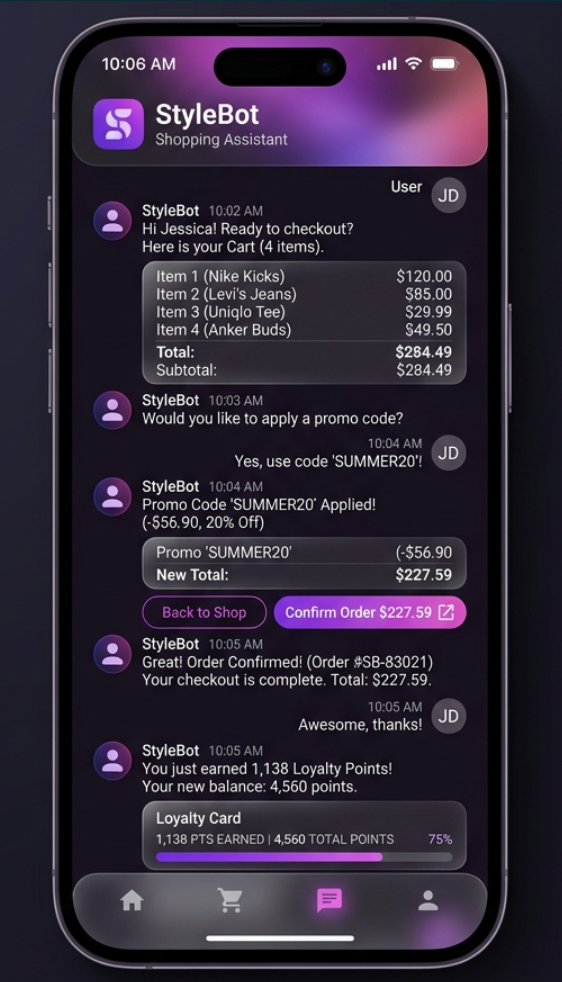
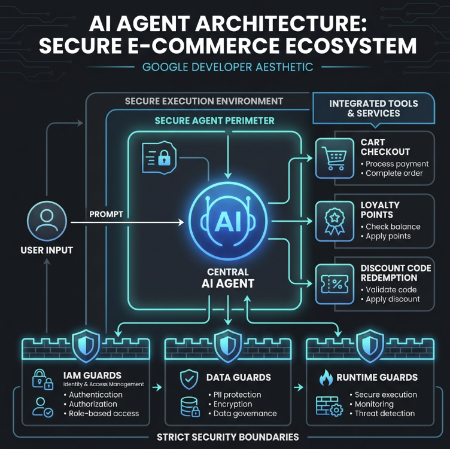

# 🛒 Secure AI Shopping Assistant Agent

[](https://github.com/google-gemini/google-adk)
[](https://deepmind.google/technologies/gemini/)
[](#-security-boundaries--guardrails)
[](#-codebase-quality-assurance)

A state-of-the-art, secure, and context-aware conversational AI shopping assistant built using Google’s **Agent Development Kit (ADK 2.0)**. The agent automates cart checkouts, applies single-use discount codes, awards loyalty points, and enforces strict security and transaction boundaries to prevent replay attacks and privilege escalation.

---

## 📱 User Experience & Architecture

### Application Interface
Below is a high-fidelity mockup of the interactive agent console, illustrating real-time cart state, discount code redemption status, and loyalty points tracking:



### Central Architecture
The agent is designed as a stateful ReAct (Reasoning and Acting) workflow. It orchestrates user intent, routes logic through secure Python tools, and utilizes localized memory to track session details.



---

## 🛠️ Tech Stack & Tooling

*   **Core Logic**: Python 3.11+
*   **Agentic Framework**: [Google Agent Development Kit (ADK 2.0)](https://google.github.io/adk-docs/)
*   **LLM Model**: [Gemini 2.5 Flash](https://deepmind.google/technologies/gemini/) (via Google Gen AI SDK)
*   **Web Services & API**: FastAPI & Uvicorn (real-time Streaming/SSE via `/run_sse`)
*   **Dependency Management**: `uv` (Astral's fast Python package manager)
*   **Quality Assurance & Linting**:
    *   **Ruff**: Modern Python Linter & Formatter
    *   **Ty**: Astral's Rust-based type checker (MyPy alternative)
    *   **Codespell**: Automated spell checking
*   **Testing**: Pytest (E2E Integration & Unit tests)

---

## 🔄 Interaction Workflow

1.  **Intent Classification**: The LLM parses the user prompt (e.g., *"Check out my cart"* or *"Redeem WELCOME50"*).
2.  **Entity Extraction**: Extract parameters: `user_id`, `cart_id`, `discount_code`, `points`, `order_id`.
3.  **Harness Validation**: Before calling tool logic, parameters undergo verification (e.g., matching the user to the cart owner).
4.  **Deterministic Execution**: Python tool execution occurs, modifying the transaction states.
5.  **Secure Response Delivery**: The result is sent back, and local memory is updated to enforce transaction boundaries.

---

## 🛡️ Security Boundaries & Guardrails

This project strictly implements a **Continuous Trust Model** adhering to the **7-Pillar Agent Security Architecture**.

```
                ┌───────────────────────────────────┐
                │    SECURE TRANSACTION HARNESS     │
                └───────────────────────────────────┘
                                  ▲
       ┌──────────────────────────┼──────────────────────────┐
       ▼                          ▼                          ▼
[Ownership Guard]        [Double-Spend Guard]       [Replay Gatekeeper]
User-to-Cart matching   Blocked re-checkout state   Processed order-id list
```

### 1. Cart Ownership Boundary
A user must not check out another user's cart.
*   **Guardrail**: The checkout logic verifies: `assert CARTS[cart_id]["user_id"] == user_id`. If they do not match, the transaction is rejected.

### 2. Double-Checkout Boundary
A shopping cart cannot be checked out multiple times (preventing race conditions or double-spending).
*   **Guardrail**: `assert not CARTS[cart_id]["is_checked_out"]` is evaluated. Subsequent checkout requests fail.

### 3. Discount Replay Boundary
Discount codes (e.g., `WELCOME50`, `SUMMER20`) are single-use.
*   **Guardrail**: The `DISCOUNT_CODES` database tracks redemption status. Reusing a redeemed code throws a failure.

### 4. Loyalty Points Replay Prevention
Ensures loyalty points cannot be claimed multiple times for the same order (replay attack protection).
*   **Guardrail**: An in-memory set `PROCESSED_ORDERS` stores all awarded order IDs. If a duplicate `order_id` is supplied, the award is rejected.

---

## 🧩 Executable Tools (API Reference)

The agent leverages three deterministic, business-logic tools bound directly to the Gemini LLM runner:

### 1. `process_cart_checkout`
Processes cart checkout, applies discount codes, calculates final amounts, and marks the cart checked out.
*   **Signature**: `process_cart_checkout(cart_id: str, user_id: str, discount_code: Optional[str] = None) -> str`
*   **Validation Rules**: Verifies user registration, cart existence, cart ownership, and discount code validity/redemption state.

### 2. `redeem_discount`
Redeems a single-use discount code for a registered user.
*   **Signature**: `redeem_discount(code: str, user_id: str) -> str`
*   **Validation Rules**: Verifies user registration, code validity, and single-use redemption status. Converts code to uppercase automatically to handle case-insensitivity.

### 3. `award_loyalty_points`
Awards points to a user after a successful purchase.
*   **Signature**: `award_loyalty_points(user_id: str, points: int, order_id: str) -> str`
*   **Validation Rules**: Verifies user registration, checks for positive point values, and checks for `order_id` reuse to block replay attacks.

---

## 📖 STRIDE Threat Model

A systematic STRIDE threat modeling assessment was performed on the current project's codebase and architecture:

### 🛡️ Spoofing (Identity Spoofing)
*   **Threat**: The `redeem_discount` tool relies on a plain string parameter `user_id` passed by the model. An attacker can spoof any registered user ID (e.g. `user123` or `student_user`) by declaring it in the prompt.
*   **Severity**: High
*   **Mitigation**: Authenticate the caller at the FastAPI application layer (e.g., using JWT/OAuth2 Bearer tokens) and bind the verified user identity to the agent session or pass it securely through `ToolContext` rather than letting the user supply it as an argument.

### ⚠️ Tampering (Data/State Manipulation)
*   **Threat**: Prompt injection attacks could instruct the LLM to call the `redeem_discount` tool with arbitrary codes, or override constraints. Furthermore, because `DISCOUNT_CODES` state is in-memory and shared globally across the app instance, concurrent users could manipulate the same codes.
*   **Severity**: Medium
*   **Mitigation**: Use Pydantic schema validation for all tool inputs. Clean and isolate state per session by moving in-memory stores to a database layer.

### 📝 Repudiation (Audit and Traceability)
*   **Threat**: Discount redemptions are performed in-memory. In the event of fraudulent activity, there is no persistent audit trail (e.g., database transaction logs) to attribute the transaction to a specific user session or request context.
*   **Severity**: Medium
*   **Mitigation**: Integrate persistent transaction logging to a secure database or write structured audit logs to Google Cloud Logging.

### 🔍 Information Disclosure (Data Leakage)
*   **Threat**: Unhandled exception stack traces from FastAPI could be returned to client responses, leaking server directory layouts or package versions.
*   **Severity**: High
*   **Mitigation**: Pull credentials dynamically from environment variables (`os.environ`) or GCP Secret Manager. Implement global exception handling middleware in FastAPI to sanitize error messages.

### 🚫 Denial of Service (Availability)
*   **Threat**: An attacker could flood the FastAPI endpoint with requests, exhausting the Gemini API rate limits and spawning infinite tool execution loops.
*   **Severity**: Medium
*   **Mitigation**: Install rate-limiting middleware (like `slowapi`) on the FastAPI application endpoints.

### 🔑 Elevation of Privilege (Access Control)
*   **Threat**: The FastAPI server lacks authorization guards; anyone with network access to the port can interact with the agent and execute discount code redemptions.
*   **Severity**: High
*   **Mitigation**: Add authentication middleware to FastAPI endpoints and restrict access control to registered client origins.

---

## 📖 Upskilling & Learning Resources

To understand the core design rules, security patterns, and agent framework, explore these references:

*   **Google ADK Documentation**: Learn the principles of building graph-based agents: [Google ADK Official Docs](https://google.github.io/adk-docs/)
*   **OWASP Top 10 for LLM Applications**: Understand LLM security risks: [OWASP LLM Security Rules](https://owasp.org/www-project-top-10-for-large-language-model-applications/)
*   **STRIDE Threat Modeling**: Learn the threat model methodology: [Microsoft STRIDE Model Guide](https://learn.microsoft.com/en-us/previous-versions/azure/security/blueprints/threat-modeling-tool-threats)
*   **Gemini API Rate Limits & Quotas**: Understand rate-limiting and quota behaviors: [Gemini API Quota Guide](https://ai.google.dev/gemini-api/docs/rate-limits)
*   **dotenv Configuration Guide**: Secure environment variable management: [Python Dotenv reference](https://pypi.org/project/python-dotenv/)

---

## 🚀 Getting Started

### 1. Installation
Install the project dependencies and setup the virtual environment:
```bash
uv sync --all-extras
```

### 2. Configure Environment Variables
Create a `.env` file in the root directory (automatically ignored by git):
```env
GEMINI_API_KEY=YOUR_GEMINI_API_KEY
GOOGLE_GENAI_USE_ENTERPRISE=FALSE
```

### 3. Codebase Quality Assurance
Run linting, formatting, spelling, and type checking:
```bash
uv run agents-cli lint
```

### 4. Running the Test Suite
We maintain unit tests for deterministic business logic, and E2E integration tests for LLM agent actions:
```bash
uv run pytest
```

### 5. Launch the Agent Playground
Start the interactive Web UI playground:
```bash
uv run adk web --host 127.0.0.1 --port 8080 --allow_origins "http://localhost:8080" --reload_agents
```
Then visit: **[http://127.0.0.1:8080/dev-ui/?app=app](http://127.0.0.1:8080/dev-ui/?app=app)**
