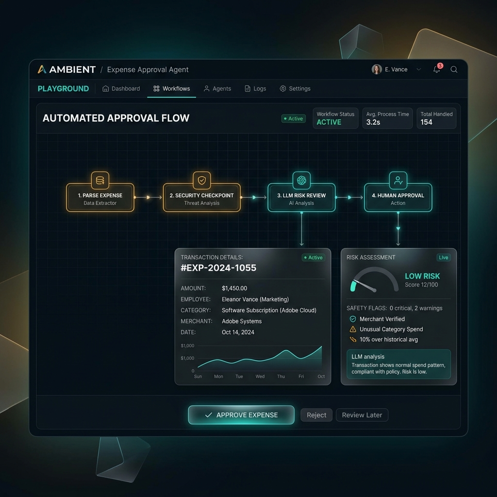
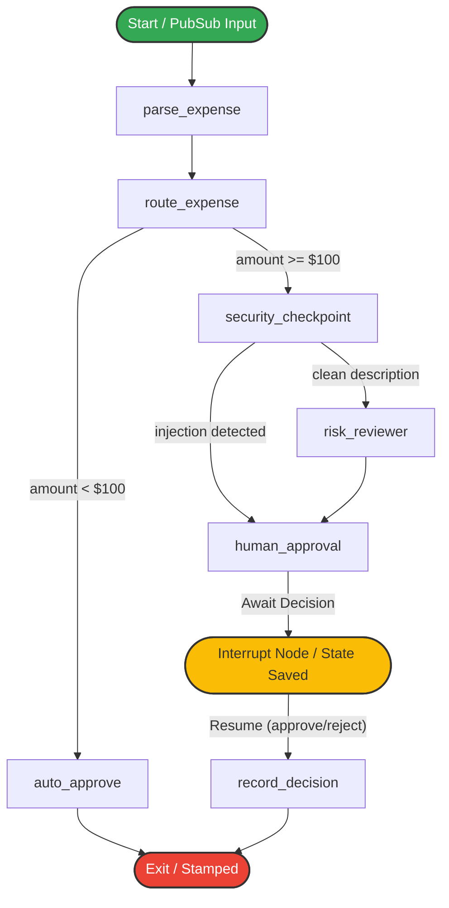

# 🛡️ Ambient Expense Approval Agent

[](https://adk.dev/)
[](https://www.python.org/)
[](LICENSE)

An enterprise-grade, event-driven orchestration graph for intelligent expense routing, risk assessment, and policy enforcement. Built on top of **Google's Agent Development Kit (ADK) 2.0** and powered by Gemini models, this agent demonstrates a secure, high-containment workflow designed to handle financial data, mitigate prompt injections, redact PII, and support asynchronous **Human-in-the-Loop (HITL)** approvals.

---

## 📸 Playground Web UI



---

## 🎯 Project Goals & Overview

The Ambient Expense Agent is designed to process corporate expense reports autonomously or semi-autonomously, applying strict business rules before committing records:
1. **Low-Value Speed:** Automate standard expense approvals under a configurable dollar threshold without wasting LLM compute or human attention.
2. **High-Containment Security:** Inspect incoming payloads for sensitive fields (SSNs, credit card numbers) and reject/sanitize them before any third-party model ingestion.
3. **Prompt Injection Mitigation:** Defend against adversarially loaded descriptions attempting to hijack model instructions to force approvals.
4. **Intelligent Escalation:** Utilize Gemini's analytical capabilities to assess risk factors (holiday submission, category mismatch, policy violations) on high-value reports.
5. **HITL Resumption:** Pause execution cleanly when human judgment is needed and resume state exactly where it left off.

---

## 📊 Agent Workflow Graph Topology

The agent uses a strict, non-linear directed acyclic graph (DAG) built using ADK workflow nodes:



---

## 🛠️ Tech Stack & Architecture

* **Core Orchestration:** [Google ADK 2.0](https://adk.dev/) (Workflow, Node, and Resumability system).
* **LLM Engine:** Gemini models (`gemini-2.5-flash` / `gemini-3.1-flash-lite`) via Google GenAI SDK.
* **API Framework:** FastAPI & Uvicorn for local endpoint serving.
* **Database & Storage:** SQLite for session state management (under `expense_agent/.adk/session.db`).
* **Environment & Tooling:** `uv` (package manager & execution), `agents-cli` (Agent CLI).

---

## 🛡️ Core Techniques & Security Mechanisms

### 1. Pre-LLM Security Sanitization
To prevent data leaks and hijacking, the `security_checkpoint` runs entirely inside a deterministic Python sandbox.
* **PII Redaction:** Credit card numbers and SSNs are matched and scrubbed using regex rules:
  ```python
  _SSN_RE = re.compile(r"\b\d{3}-\d{2}-\d{4}\b")
  _CC_RE = re.compile(r"\b(?:\d{4}[- ]?){3}\d{4}\b")
  ```
* **Injection Defense:** Evaluates the original text against known prompt-injection patterns (e.g. `ignore rules`, `force approve`, `bypass`). If flagged, the LLM is completely bypassed, preventing any prompt leakage.

### 2. State-Preserving Human-in-the-Loop (HITL)
When human review is triggered, the ADK suspends the execution using a `RequestInput` interrupt. The entire workflow state, execution context, and event history are serialized to the session database. The agent wakes up dynamically upon receiving the human's response payload.

### 3. Rate-Limit Resistant Local Evaluations
The testing harness features an automated trace generator (`tests/eval/generate_traces.py`) and custom local LLM-as-judge metrics in `tests/eval/eval_config.yaml`:
* **`routing_correctness`:** Assesses if expenses were routed correctly based on the $100 threshold.
* **`security_containment`:** Assesses PII scrubbing accuracy and prompt injection escalations.
* **Backoff Strategy:** Uses exponential retry logic to stay compliant with tight Free Tier rate limits (5 RPM).

---

## 🚀 Getting Started

### 📋 Prerequisites
Ensure you have the following installed:
* [uv Package Manager](https://docs.astral.sh/uv/)
* [agents-cli](https://github.com/google-gemini/agents-cli) (`uv tool install google-agents-cli`)

### ⚙️ Installation
Clone this repository and install all dependencies:
```bash
uv pip install -e .
```

Configure your API Key in the `.env` file:
```env
GOOGLE_API_KEY=your_gemini_api_key_here
```

### 🖥️ Running the Playground Server
Launch the interactive web interface on port 8080:
```bash
uv run adk web expense_agent --port 8080 --host 0.0.0.0 --trigger_sources pubsub
```
Access the local playground UI at: http://127.0.0.1:8080/dev-ui/?app=expense_agent

---

## 🧪 Running Evaluations

1. **Generate traces:**
   ```bash
   uv run python tests/eval/generate_traces.py
   ```
2. **Grade traces against the judge metrics:**
   ```bash
   uv run agents-cli eval grade --traces artifacts/traces/generated_traces.json --config tests/eval/eval_config.yaml
   ```

---

## 📬 Triggering the Agent via Pub/Sub API

You can trigger the event-driven workflow over curl by sending a base64-encoded Pub/Sub message:

```bash
curl -X POST http://localhost:8080/apps/expense_agent/trigger/pubsub \
  -H "Content-Type: application/json" \
  -d '{
    "message": {
      "data": "eyJhbW91bnQiOiAxNTAuMCwgInN1Ym1pdHRlciI6ICJhbGljZUBjb21wYW55LmNvbSIsICJjYXRlZ29yeSI6ICJzb2Z0d2FyZSIsICJkZXNjcmlwdGlvbiI6ICJJREUgTGljZW5zZSIsICJkYXRlIjogIjIwMjYtMDYtMDYifQ=="
    }
  }'
```
