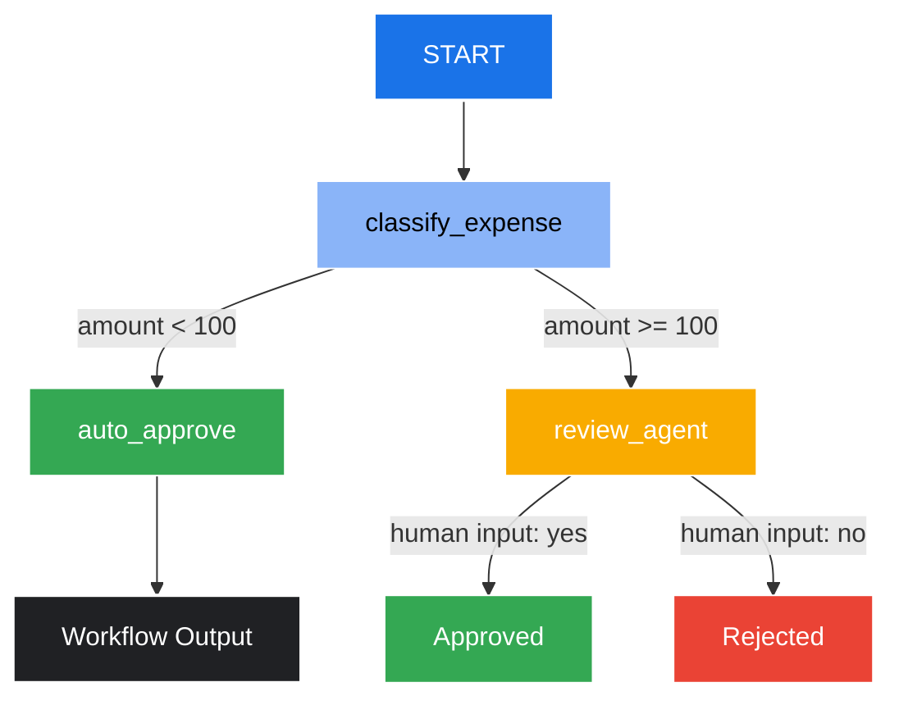

# Ambient Expense Agent (ADK 2.0)

[](https://cloud.google.com/vertex-ai)
[](https://adk.dev)
[](https://www.python.org/)

An ambient enterprise agent built with the Google **Agent Development Kit (ADK 2.0)** and deployed on **Gemini Enterprise Agent Runtime**. The agent automates employee expense reporting by instantly approving standard claims under $100 and routing larger claims ($100+) to a human reviewer using a stateful human-in-the-loop pause.

Developed as part of the **Google 5-Day Intensive Vibe Coding Course**.

---

## 📖 Table of Contents
1. [Workflow & Routing](#-workflow--routing)
2. [Architecture](#-architecture)
3. [Technology Stack](#-technology-stack)
4. [Project Structure](#-project-structure)
5. [Upskilling & References](#-upskilling--references)
6. [Getting Started](#-getting-started)
7. [Deployment to Agent Runtime](#-deployment-to-agent-runtime)

---

## 🔄 Workflow & Routing

The agent uses a deterministic graph workflow to classify, route, and resolve expense reports. The flowchart below visualizes the execution logic:



### Routing Rules:
1. **Auto-Approval (`auto_approve`)**: Any standard expense claim where `amount < 100.0` is instantly approved without human intervention.
2. **Review Pause (`review_agent`)**: Any expense claim where `amount >= 100.0` pauses execution using `RequestInput` and awaits reviewer feedback.
3. **Turn Resumption**: Once manual input is received (via a `FunctionResponse` matching the interrupt ID `manual_approval`), the workflow rehydrates, fast-forwards earlier completed nodes, and resumes execution to produce the final `ExpenseResult`.

---

## 🏛️ Architecture

This agent is built as a stateful graph workflow utilizing the **ADK 2.0 Workflows API**. 

* **State Persistence & Rehydration**: On a human-in-the-loop pause, the workflow records its current state (the parsed `ExpenseInput`) inside the session database. On resumption, the `_replay_interceptor` rehydrates the session, automatically replaying completed nodes without executing their underlying python functions again, ensuring fast response times and deterministic execution.
* **Loose Payload Coupling**: The entrypoint accepts generic JSON structures (supporting nested `"data"` keys found in standard webhooks) and maps them dynamically to the `ExpenseInput` schema.
* **Default/Optional Fields**: Fields such as `merchant` and `description` are marked optional, defaulting to safe stand-in values (e.g. `"Unknown Merchant"`) to prevent runtime schema validation errors.

---

## 🛠️ Technology Stack

* **Orchestration**: [Google ADK 2.0](https://adk.dev/) Workflows API (Graph Routing & HITL).
* **Package Manager**: [uv](https://docs.astral.sh/uv/) (Astral's high-performance Python package manager).
* **Validation & Schemas**: [Pydantic v2](https://docs.pydantic.dev/) for I/O serialization.
* **Server/Deployment**: Vertex AI Reasoning Engine (Gemini Enterprise Agent Runtime) with FastAPI wrappers.
* **Infrastructure**: Terraform (scaffolded in `deployment/terraform/` for IAM bindings, Cloud Trace, and Google Cloud Storage).

---

## 📁 Project Structure

```
expense-agent/
├── app/                        # Core agent code
│   ├── agent.py                # Main workflow logic (Schemas, Nodes, and Graph)
│   ├── agent_runtime_app.py    # Vertex AI Reasoning Engine initialization
│   └── app_utils/              # Logging, Telemetry & standard helpers
├── deployment/                 # Production infrastructure configuration
│   └── terraform/              # Terraform scripts (single-project setup & telemetry)
├── tests/                      # Unit and performance tests
├── pyproject.toml              # Project dependencies and tool configurations
├── uv.lock                     # Locked dependencies (100% deterministic builds)
└── agents-cli-manifest.yaml    # CLI configuration manifest
```

---

## 🎓 Upskilling & References

To learn more about the technologies and methodologies used in this project:

* **Course Material**: [Google 5-Day Intensive Vibe Coding Course](https://github.com/google-gemini/vibe-coding)
* **ADK Docs**: [Official Agent Development Kit Documentation](https://adk.dev/)
* **Google Cloud SDK**: [Vertex AI Reasoning Engine / Agent Runtime Docs](https://cloud.google.com/vertex-ai/docs)
* **Pydantic**: [Pydantic v2 Documentation](https://docs.pydantic.dev/latest/)

---

## 🚀 Getting Started

### Prerequisites:
Make sure you have `uv` installed ([Install uv](https://docs.astral.sh/uv/getting-started/installation/)):
```bash
powershell -c "irm https://astral.sh/uv/install.ps1 | iex"
```

### Installation:
1. Setup the Agents CLI and link ADK skills globally:
   ```bash
   uvx google-agents-cli setup
   ```
2. Sync the project environment and install dependencies:
   ```bash
   agents-cli install
   ```
3. Test locally in the ADK web playground:
   ```bash
   agents-cli playground
   ```

---

## 🌐 Deployment to Agent Runtime

To deploy the agent to Google Cloud:

1. Configure your GCP project:
   ```bash
   gcloud config set project <your-project-id>
   ```
2. Deploy the Reasoning Engine to us-east1:
   ```bash
   agents-cli deploy
   ```
