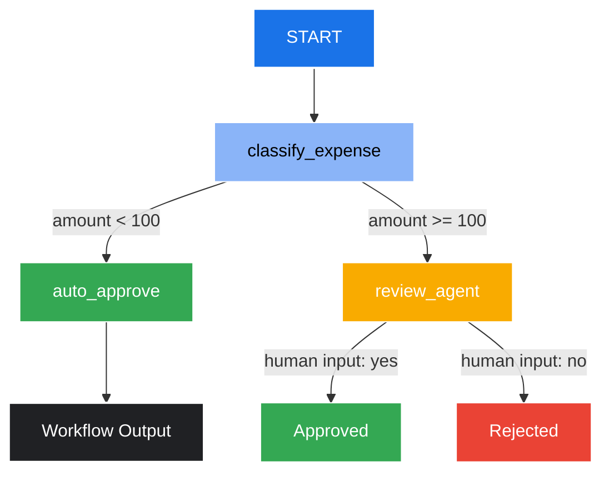
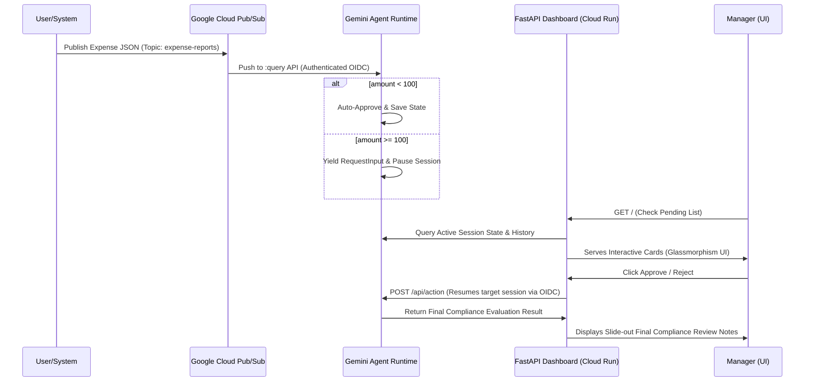

# Google Cloud Ambient Expense Agent (ADK 2.0)


[](https://cloud.google.com/vertex-ai)
[](https://adk.dev)
[](https://www.python.org/)
[](https://fastapi.tiangolo.com/)

An ambient enterprise agent built with the Google **Agent Development Kit (ADK 2.0)**, deployed on **Gemini Enterprise Agent Runtime** (Vertex AI Reasoning Engine), and integrated with an asynchronous Pub/Sub event pipeline and a Manager Dashboard. The agent automates employee expense reporting by instantly approving claims under $100 and routing larger claims ($100+) to a human manager using a stateful human-in-the-loop pause.

Developed as part of the **Google 5-Day Intensive Vibe Coding Course**.

---

## 📖 Table of Contents
1. [What is this Agent?](#-what-is-this-agent)
2. [Workflow & Graph Routing](#-workflow--graph-routing)
3. [Event-Driven Architecture](#-event-driven-architecture)
4. [Technology Stack](#-technology-stack)
5. [Project Structure](#-project-structure)
6. [How It's Built](#-how-its-built)
7. [Upskilling & References](#-upskilling--references)
8. [Getting Started](#-getting-started)
9. [Cloud Deployment & Cleanup](#-cloud-deployment--cleanup)

---

## 🤖 What is this Agent?

The **Ambient Expense Agent** is an automated compliance and routing system designed to manage employee expense receipts. It processes inputs asynchronously, automatically reviews compliance rules, instantly approves micro-claims, and intelligently pauses its execution flow for manager review on larger expenditures. 

### Core Features:
* **Micro-Claims Auto-Approval**: Instantly processes and approves any expense under $100.
* **Human-in-the-Loop (HITL) Intervention**: Pauses processing for any expense $100+ and generates an interactive review card on the manager's dashboard.
* **Asynchronous Integration**: Listens to an enterprise event bus (Google Cloud Pub/Sub) via authenticated push endpoints.
* **Stateful Rehydration**: Persists state during human review and resumes execution cleanly when approved or rejected by a manager.

---

## 🔄 Workflow & Graph Routing

The agent uses a deterministic graph workflow to classify, route, and resolve expense reports. The flowchart below visualizes the execution logic:



### Routing Rules:
1. **Auto-Approval (`auto_approve`)**: Any standard expense claim where `amount < 100.0` is instantly approved without human intervention.
2. **Review Pause (`review_agent`)**: Any expense claim where `amount >= 100.0` pauses execution using `RequestInput` and awaits reviewer feedback.
3. **Turn Resumption**: Once manual input is received (via a `FunctionResponse` matching the interrupt ID `manual_approval`), the workflow rehydrates, fast-forwards earlier completed nodes, and resumes execution to produce the final `ExpenseResult`.

---

## 🏛️ Event-Driven Architecture

This project integrates a complete event-driven pipeline and human-in-the-loop dashboard in front of the core Agent Runtime engine:



### Key Integration Points:
* **State Persistence & Rehydration**: On a human-in-the-loop pause, the workflow records its current state (`ExpenseInput`) inside the session database. On resumption, the ADK framework automatically replays completed nodes without re-running their underlying functions, ensuring fast response times and deterministic execution.
* **Pub/Sub Push Pipeline**: Utilizes OIDC token authentication targeting the Agent Runtime's `:query` REST endpoint, featuring `--push-no-wrapper` payload unwrapping, a 10-minute ack deadline, and dead-letter routing to `expense-reports-dead-letter` after 5 failed attempts.
* **FastAPI Manager Dashboard**: Serves a sleek, glassmorphic UI utilizing Outfit Google Fonts, real-time pending approvals listing, and slide-out compliance evaluation reviews.

---

## 🛠️ Technology Stack

* **Orchestration**: [Google ADK 2.0](https://adk.dev/) Workflows API (Graph Routing & HITL).
* **Package Manager**: [uv](https://docs.astral.sh/uv/) (Astral's high-performance Python package manager).
* **Validation & Schemas**: [Pydantic v2](https://docs.pydantic.dev/) for I/O serialization.
* **Server/Deployment**: Vertex AI Reasoning Engine (Gemini Enterprise Agent Runtime) with FastAPI wrappers.
* **Integration APIs**: Google Cloud Pub/Sub, Google Cloud Run (serving the Dashboard).
* **UI/UX**: HTML5, Vanilla CSS (Glassmorphism, custom animations, dark-mode radial gradients).

---

## 📁 Project Structure

```
expense-agent/
├── app/                        # Core agent code
│   ├── agent.py                # Main workflow logic (Schemas, Nodes, and Graph)
│   ├── agent_runtime_app.py    # Vertex AI Reasoning Engine initialization & query methods
│   └── app_utils/              # Logging, Telemetry & standard helpers
├── submission_frontend/        # FastAPI Dashboard service
│   ├── main.py                 # FastAPI endpoints & inline responsive HTML UI
│   ├── Dockerfile              # Containerization recipe for Cloud Run
│   └── pyproject.toml          # Dashboard python package metadata
├── deployment/                 # Production infrastructure configuration
│   └── terraform/              # Terraform scripts (single-project setup & telemetry)
├── tests/                      # Unit and performance tests
├── pyproject.toml              # Project dependencies and tool configurations
├── uv.lock                     # Locked dependencies (100% deterministic builds)
└── agents-cli-manifest.yaml    # CLI configuration manifest
```

---

## 🔧 How It's Built

1. **State Machine Definition**: Designed using the `google-adk` framework's `Workflows` module, modeling state transitions as nodes (e.g., `classify_expense`, `auto_approve`, `review_agent`).
2. **HITL Interruption**: Configured using `RequestInput(id="manual_approval", ...)` to hold the thread, writing session logs out to Vertex AI metadata.
3. **Endpoint Integration**: Wrapped the ADK workflow within a FastAPI endpoint `query` to receive plain Pub/Sub push requests seamlessly.
4. **Dashboard Front-end**: Built a real-time reactive page utilizing glassmorphic styles, responsive grids, and clean layout paradigms to render the current status of reasoning engine instances.

---

## 🎓 Upskilling & References

To learn more about the Google Agent technologies used:

* **Upskill Link**: [Google 5-Day Intensive Vibe Coding Course](https://github.com/google-gemini/vibe-coding)
* **ADK Docs**: [Official Agent Development Kit Documentation](https://adk.dev/)
* **Google Cloud SDK**: [Vertex AI Reasoning Engine / Agent Runtime Docs](https://cloud.google.com/vertex-ai/docs)
* **Pydantic**: [Pydantic v2 Documentation](https://docs.pydantic.dev/latest/)

---

## 🚀 Getting Started

### Prerequisites:
Make sure you have `uv` installed ([Install uv](https://docs.astral.sh/uv/getting-started/installation/)):
```bash
powershell -c "irm https://astral.sh/uv/install.ps1 | iex"
```

### Installation:
1. Setup the Agents CLI and link ADK skills globally:
   ```bash
   uvx google-agents-cli setup
   ```
2. Sync the project environment and install dependencies:
   ```bash
   agents-cli install
   ```
3. Test locally in the ADK web playground:
   ```bash
   agents-cli playground
   ```

---

## 🌐 Cloud Deployment & Cleanup

### Project Configuration
Configure active project and enable APIs:
```bash
gcloud config set project <PROJECT_ID>
gcloud services enable aiplatform.googleapis.com run.googleapis.com pubsub.googleapis.com cloudbuild.googleapis.com cloudresourcemanager.googleapis.com
```

### Deployment Commands

1. **Deploy Agent to Agent Runtime**:
   ```bash
   agents-cli deploy --no-confirm-project
   ```

2. **Deploy Manager Dashboard**:
   ```bash
   gcloud run deploy expense-manager-dashboard \
       --source ./submission_frontend \
       --region us-east1 \
       --allow-unauthenticated \
       "--set-env-vars=GOOGLE_CLOUD_PROJECT=<PROJECT_ID>,AGENT_RUNTIME_ID=<REASONING_ENGINE_ID>,GOOGLE_CLOUD_LOCATION=us-east1"
   ```

3. **Set Up Pub/Sub Event Pipeline**:
   ```bash
   # Create Topics
   gcloud pubsub topics create expense-reports
   gcloud pubsub topics create expense-reports-dead-letter

   # Create Service Account
   gcloud iam service-accounts create pubsub-invoker --display-name="Pub/Sub Agent Runtime Invoker"

   # Assign Permissions
   gcloud projects add-iam-policy-binding <PROJECT_ID> --member="serviceAccount:pubsub-invoker@<PROJECT_ID>.iam.gserviceaccount.com" --role="roles/aiplatform.user"
   gcloud iam service-accounts add-iam-policy-binding pubsub-invoker@<PROJECT_ID>.iam.gserviceaccount.com --member="serviceAccount:service-<PROJECT_NUMBER>@gcp-sa-pubsub.iam.gserviceaccount.com" --role="roles/iam.serviceAccountTokenCreator"
   gcloud pubsub topics add-iam-policy-binding expense-reports-dead-letter --member="serviceAccount:service-<PROJECT_NUMBER>@gcp-sa-pubsub.iam.gserviceaccount.com" --role="roles/pubsub.publisher"
   gcloud projects add-iam-policy-binding <PROJECT_ID> --member="serviceAccount:service-<PROJECT_NUMBER>@gcp-sa-pubsub.iam.gserviceaccount.com" --role="roles/pubsub.subscriber"

   # Create Push Subscription
   gcloud pubsub subscriptions create expense-reports-push \
       --topic=expense-reports \
       --push-endpoint="https://us-east1-aiplatform.googleapis.com/v1beta1/projects/<PROJECT_NUMBER>/locations/us-east1/reasoningEngines/<REASONING_ENGINE_ID>:query" \
       --push-no-wrapper \
       --ack-deadline=600 \
       --push-auth-service-account=pubsub-invoker@<PROJECT_ID>.iam.gserviceaccount.com \
       --push-auth-token-audience="https://us-east1-aiplatform.googleapis.com/v1beta1/projects/<PROJECT_NUMBER>/locations/us-east1/reasoningEngines/<REASONING_ENGINE_ID>:query" \
       --dead-letter-topic=expense-reports-dead-letter \
       --max-delivery-attempts=5
   ```

### Cleanup Commands
To remove the created resources:
```bash
gcloud run services delete expense-manager-dashboard --region=us-east1 --quiet
gcloud pubsub subscriptions delete expense-reports-push --quiet
gcloud pubsub topics delete expense-reports expense-reports-dead-letter --quiet
gcloud iam service-accounts delete pubsub-invoker@<PROJECT_ID>.iam.gserviceaccount.com --quiet
```
